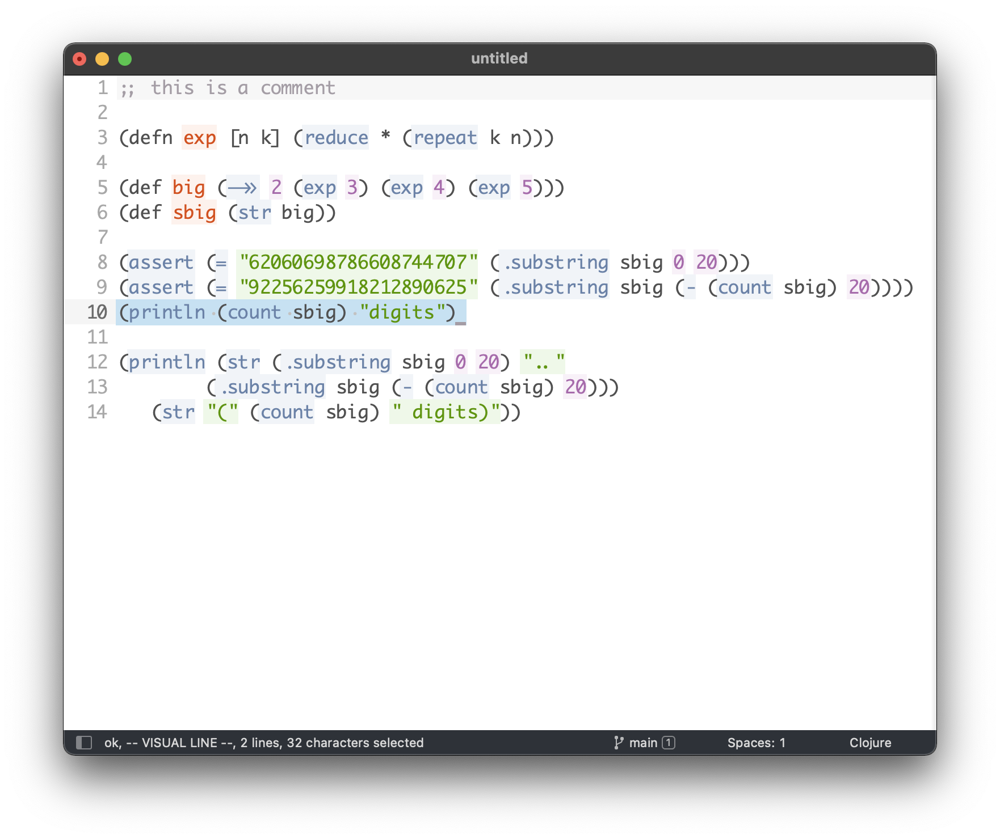

# sublime-twilight-bright-color
twilight bright colour scheme for sublime text

this is a port from an [emacs color scheme](https://github.com/jimeh/twilight-bright-theme.el) 
with the same name.

# screenshots

